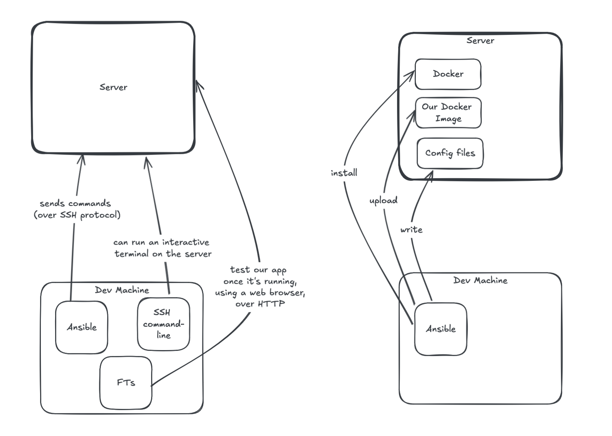

# Test-Driven Development with Python

This repository contains the practical examples from the book *Test-Driven Development with Python* by Harry J.W. Percival. It reflects the current state of the To-Do List application as I progress through the book. 

📌 **Repository under continuous update.**  

## 📖 About the Book  
The book *TDD with Python* teaches the Test-Driven Development (TDD) methodology using Python and Django. It covers everything from the fundamentals of automated testing to building a complete web application while applying best development practices.  

## 🛠️ Technologies Used
- **Django** - Web framework for application development  
- **Selenium** - Tool for automated functional testing  
- **Unittest** - Python's built-in testing framework  

## 📂 Project Structure
```
.
├── Dockerfile
├── db.sqlite3
├── src
|   ├── functional_tests
|   │   ├── __init__.py
|   │   ├── tests.py
|   ├── lists
|   │   ├── __init__.py
|   │   ├── admin.py
|   │   ├── apps.py
|   │   ├── migrations
|   │   │   ├── 0001_initial.py
|   │   │   ├── 0002_item_text.py
|   │   │   └── __init__.py
|   │   ├── models.py
|   │   ├── static
|   │   │   └── bootstrap
|   |   │       ├── css
|   |   |       │   ├── bootstrap-grid.css
|   │   │       |   ├── [...]
|   │   │       |   └── bootstrap.rtl.min.css.map
|   |   │       └── js
|   |   |           ├── bootstrap.bundle.js
|   │   │           ├── [...]
|   │   │           └── bootstrap.min.js.map
|   │   ├── templates
|   │   │   ├── home.html
|   │   │   └── list.html
|   │   ├── tests.py
|   │   └── views.py
|   ├── manage.py
|   └── superlists
|       ├── __init__.py
|       ├── asgi.py
|       ├── settings.py
|       ├── urls.py
|       └── wsgi.py
└──static
    └── [...]
```

# Some considerations
This project uses Ansible, which does not natively support Windows as a control node due to platform limitations. However, it can be run on Windows through alternative methods, such as using the Windows Subsystem for Linux (WSL) or running it inside a container. It's important to note that WSL is not officially supported by Ansible and is not recommended for production environments.

To use Ansible, I had to enable and migrate to WSL on my Windows machine. Here are the steps I followed:
1. Open PowerShell as Administrator
2. Run the following command to install WSL and specify Ubuntu as the distribution:
```
wsl --install -d Ubuntu
```
3. Restart your computer if prompted
4. To access the WSL environment, run:
```
wsl
```

5. The first time you open WSL, it will ask you to create an username and password for you Linux user

<br>Once WSL was installed and configured, the user directory became `/home/<Linux user>`.<br>
To access the VPS using SSH, I had to create the public and private keys in `/home/<Linux user>/.ssh/` so they could be properly found by the SSH client.<br>
If you get an error `WARNING: UNPROTECTED PRIVATE KEY FILE!`, check if the correct permission levels are applied:
- The `.ssh` directory must have permission `700`:
```
chmod 700 ~/.ssh
```
- The private key file must have permission `600`:
```
chmod 600 ~/.ssh/<your private key filename>
```

If you need to access your Windows files from WSL, the path starts with `/mnt/c/` instead of `C:/`.<br>
For example, if you want to access `C:/<Windows user>/<your project folder>`, the corresponding path in WSL is `/mnt/c/<Windows user>/<your project folder>`.

I also recreated my Python virtual environment inside WSL. This was necessary to activate it from a Unix-based environment rather than Windows, to use the libraries listed in `requirements.txt`.


## Ansible vs SSH: How we talk to our server


[Source: Percival, Harry. TDD with Python - Chapter 11]('https://www.obeythetestinggoat.com/book/chapter_11_server_prep.html#ansible-and-ssh)

## Next steps
Apply improvements suggested by the author. A few candidates for further study:
- The `` template tag, for more DRY and fewer hardcoded URLs
- Client-side packaging tools, like `npm` and `bower`
- Customising bootstrap with SASS